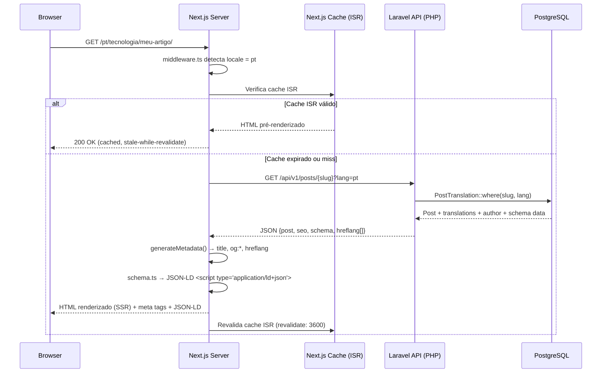
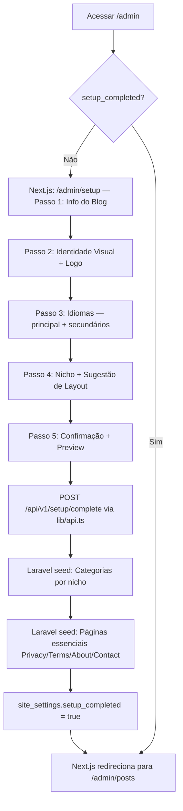
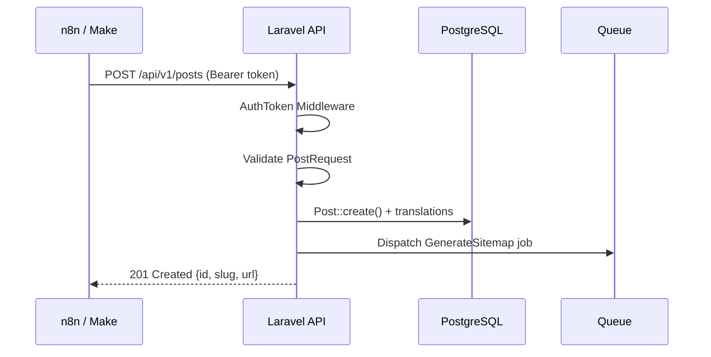

## 2. ARQUITETURA COMPLETA

### 2.1 Arquitetura Adotada — Decisão Definida no PRD v2.0

A arquitetura está **definida no PRD**: backend PHP 8 + frontend Next.js. O documento registra as duas alternativas avaliadas antes da decisão:

#### Alternativa A — Laravel (PHP 8) API Headless + Next.js 15 *(ADOTADA — PRD v2.0)*
- **Pontos positivos:** separação de responsabilidades clara, Next.js com SSR/ISR nativo leva vantagem real em Core Web Vitals, Metadata API nativa do Next.js para SEO, `next-intl` para i18n de rotas (`/pt/`, `/en/`), GrapesJS no painel admin React sem impacto no frontend público
- **Pontos negativos:** dois projetos para manter e deployar, CORS obrigatório, Next.js exige Node.js (VPS ou Vercel), maior complexidade de CI/CD

#### Alternativa B — Laravel + Inertia.js + Vue 3 (Monolito)
- **Descartada pelo PRD v2.0** — PRD define explicitamente Next.js como frontend

#### Decisão Arquitetural: **PHP 8 (Laravel 11) como API Headless + Next.js 15 como Frontend/Admin**
**Justificativa (PRD v2.0, Seção 3):** O sistema fica com backend Laravel (PHP 8) responsável exclusivamente pela API REST, persistência, filas, sitemaps, jobs e autenticação. O Next.js (App Router + TypeScript) consome a API e entrega o frontend público com SSR/ISR e o painel admin como SPA. A API PHP pode ser hospedada em shared hosting; o Next.js requer Node.js (Vercel ou VPS).

---

### 2.2 Visão Geral da Arquitetura

```
┌─────────────────────────────────────────────────────────────┐
│                        CLIENTE                              │
│  Browser (Visitor)          Browser (Admin)                 │
└────────────┬────────────────────────┬───────────────────────┘
             │ HTTPS                  │ HTTPS
             ▼                        ▼
┌─────────────────────────────────────────────────────────────┐
│             NEXT.JS 15 (Node.js — Vercel ou VPS)            │
│  App Router + TypeScript + next-intl + Tailwind CSS         │
│  ┌─────────────────────┐  ┌────────────────────────────┐   │
│  │ /[locale]/...       │  │ /admin/...                 │   │
│  │ Frontend Público    │  │ Painel Admin               │   │
│  │ Server Components   │  │ React + GrapesJS           │   │
│  │ SSR / ISR / SSG     │  │ Client Components SPA      │   │
│  └──────────┬──────────┘  └───────────┬────────────────┘   │
│             └──────────────┬──────────┘                     │
│                            │ REST API (HTTPS)               │
└────────────────────────────┼────────────────────────────────┘
                             │
                             ▼
┌─────────────────────────────────────────────────────────────┐
│       PHP 8 — LARAVEL 11 API (Shared Hosting ou VPS)        │
│  ┌────────────┐ ┌────────────────┐ ┌──────────────────────┐ │
│  │ API Layer  │ │   Services     │ │  Console / Queue     │ │
│  │ /api/v1/*  │ │ SeoService     │ │ GenerateSitemap      │ │
│  │ Sanctum    │ │ SchemaService  │ │ PublishScheduled     │ │
│  │ CORS config│ │ MediaService   │ │ cron schedule        │ │
│  └──────┬─────┘ └────────────────┘ └──────────────────────┘ │
│         │              Eloquent ORM                         │
└─────────┼───────────────────────────────────────────────────┘
          ▼
┌─────────────────────────────────────────────────────────────┐
│         PostgreSQL 15+          Redis (Cache + Queues)      │
└─────────────────────────────────────────────────────────────┘
          ▼
┌─────────────────────────────────────────────────────────────┐
│   STORAGE: Local Disk (shared hosting) / S3-compatible VPS  │
└─────────────────────────────────────────────────────────────┘
```

**Fronteiras de responsabilidade:**
- `next-intl` gerencia rotas localizadas (`/pt/`, `/en/`) e traduções de strings da UI no Next.js
- `hreflang`, `canonical`, `og:*`, schema JSON-LD são gerados nos **Server Components** do Next.js, consumindo dados da API PHP
- Sitemaps XML são gerados pelo **Laravel** (job assíncrono) e servidos em `/sitemap.xml`
- GrapesJS roda exclusivamente em **Client Components** dentro de `/admin` — nunca no frontend público

---

### 2.3 Módulos e Responsabilidades

#### Projeto 1 — Backend: `blog-api/` (Laravel 11, PHP 8.3)

```
blog-api/
├── app/
│   ├── Http/
│   │   ├── Controllers/Api/v1/  → PostController, PageController,
│   │   │                         CategoryController, MediaController,
│   │   │                         MenuController, AuthController,
│   │   │                         SettingController, SetupController
│   │   ├── Middleware/
│   │   │   ├── EnsureSetupComplete  → bloqueia API até setup finalizado
│   │   │   └── CheckApiToken        → valida Bearer token p/ rotas externas
│   │   └── Requests/            → FormRequests por recurso
│   ├── Models/              → Post, Page, Category, Author,
│   │                          Menu, MenuItem, Media, Language,
│   │                          SiteSetting, User
│   ├── Services/
│   │   ├── SeoService           → hreflang payload, canonical URL
│   │   ├── SitemapService       → gera XML sitemaps por idioma
│   │   ├── SchemaService        → JSON-LD Article, Author, Org
│   │   ├── MediaService         → upload, WebP/AVIF, storage
│   │   └── SetupService         → wizard, seed por nicho
│   ├── Jobs/
│   │   ├── GenerateSitemap      → job assíncrono pós-publish
│   │   └── PublishScheduled     → job p/ posts agendados
│   └── Console/Commands/
│       └── PublishPosts         → cron dispára Jobs acima
├── routes/api.php           → todas as rotas REST versionadas
└── config/cors.php          → CORS configurado com `allowed_origins`
```

#### Projeto 2 — Frontend: `blog-frontend/` (Next.js 15, TypeScript)

```
blog-frontend/
├── app/
│   ├── [locale]/              → i18n routing com next-intl
│   │   ├── page.tsx             → Homepage (Server Component, ISR)
│   │   ├── [category]/
│   │   │   └── [slug]/page.tsx   → Post page (SSR / ISR)
│   │   └── [...slug]/page.tsx  → Páginas estáticas
│   ├── admin/                 → Painel admin (autentica via Sanctum)
│   │   ├── posts/               → CRUD posts (Client Components)
│   │   ├── pages/               → CRUD páginas
│   │   ├── media/               → Biblioteca de mídia
│   │   ├── menus/               → Drag-and-drop menus
│   │   ├── settings/            → Configurações gerais
│   │   └── setup/               → Setup Wizard 5 passos
│   └── sitemap.ts             → Redireciona para /sitemap.xml do Laravel
├── components/
│   ├── public/                → PostCard, Breadcrumb, AuthorBox, AdBlock
│   ├── admin/                 → GrapesJSEditor, MediaPicker, MenuBuilder
│   └── layouts/               → Layout1Clean, Layout2Magazine, Layout3Minimal
├── lib/
│   ├── api.ts                 → Wrapper fetch para o Laravel API
│   ├── seo.ts                 → generateMetadata() helpers
│   └── schema.ts              → JSON-LD builders (Article, Breadcrumb)
├── i18n/                    → Arquivos de tradução da UI (JSON)
└── middleware.ts            → next-intl locale detection + /admin auth guard
```

---

### 2.4 Fluxo de Requisição Pública (SSR via Next.js)



---

### 2.5 Fluxo de Setup Wizard (Next.js → PHP API)



---

### 2.6 Fluxo da API REST (Automação)



---