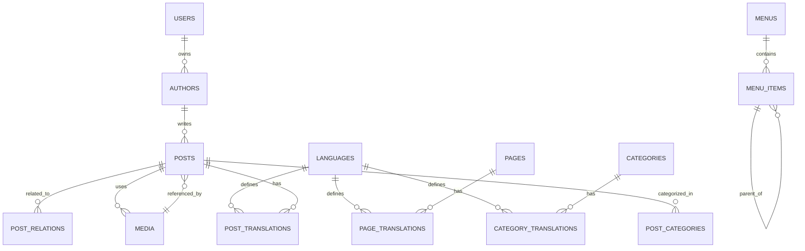

# 3. MODELO DE DADOS

Nota: usar o padrão de tabelas principais + `_translations` para campos localizáveis. Preferência por PostgreSQL (jsonb, citext).

## 3.1 Tabelas Principais (detalhado)

- `languages` — (id, code, name, locale, is_default, is_active, url_prefix, created_at, updated_at)
- `users` — (id, name, email, password, role, api_token, remember_token, created_at, updated_at)
- `site_settings` — (id, key, value json, type, group, created_at, updated_at)
- `authors` — (id, user_id, name, slug, bio json, avatar, social_links json, schema_same_as json, created_at, updated_at)
- `categories` — (id, parent_id, image, sort_order, is_active, created_at, updated_at)
- `category_translations` — (id, category_id, language_code, name, slug, description, meta_title, meta_description, UNIQUE(category_id, language_code))
- `posts` — (id, author_id, featured_image, status, published_at, scheduled_at, reading_time, allow_comments, created_at, updated_at)
- `post_translations` — (id, post_id, language_code, title, slug, excerpt, body, grapesjs_data json, meta_title, meta_description, og_title, og_image, schema_custom json, UNIQUE(post_id, language_code), INDEX(slug, language_code))
- `post_categories` — pivot (post_id, category_id)
- `post_relations` — (id, original_post_id, translated_post_id, language_code, UNIQUE(original_post_id, language_code))
- `pages` — (id, type, is_system, status, created_at, updated_at)
- `page_translations` — (id, page_id, language_code, title, slug, body, grapesjs_data json, meta_title, meta_description, UNIQUE(page_id, language_code))
- `media` — (id, filename, disk_path, webp_path, avif_path, mime_type, size_bytes, width, height, folder, tags json, alt_text json, title json, uploaded_by, created_at, updated_at)
- `menus` — (id, name, location, language_code, created_at, updated_at)
- `menu_items` — (id, menu_id, parent_id, label json, linkable_type, linkable_id, custom_url, target, sort_order, created_at, updated_at)

### 3.2 Estratégia de Multilinguagem

Padrão adotado: **Tabelas de tradução separadas (`_translations`)** compatível com `spatie/laravel-translatable` (JSON column) para campos simples, e tabelas relacionais para conteúdo extenso.

Para campos curtos (title, slug, meta_title, meta_description): **JSON column** em uma única tabela.
Para conteúdo extenso (body HTML do GrapesJS): **tabela `post_translations`** separada.

---

### 3.3 Tabelas Principais

#### `languages`
| Campo | Tipo | Observações |
|---|---|---|
| id | BIGINT PK | |
| code | VARCHAR(10) | ex: `pt`, `en`, `es` — UNIQUE |
| name | VARCHAR(100) | ex: "Português" |
| locale | VARCHAR(20) | ex: `pt_BR`, `en_US` |
| is_default | BOOLEAN | Apenas um pode ser true |
| is_active | BOOLEAN | |
| url_prefix | VARCHAR(10) | ex: `/pt/` — UNIQUE |
| created_at / updated_at | TIMESTAMP | |

---

#### `site_settings`
| Campo | Tipo | Observações |
|---|---|---|
| id | BIGINT PK | |
| key | VARCHAR(100) UNIQUE | ex: `site_name`, `primary_color` |
| value | TEXT | |
| type | VARCHAR(50) | string, json, boolean, file |
| group | VARCHAR(100) | general, seo, appearance, monetization |
| created_at / updated_at | TIMESTAMP | |

---

#### `authors`
| Campo | Tipo | Observações |
|---|---|---|
| id | BIGINT PK | |
| user_id | BIGINT FK → users | |
| name | VARCHAR(200) | |
| slug | VARCHAR(200) UNIQUE | |
| bio | JSON | `{"pt": "...", "en": "..."}` translatable |
| avatar | VARCHAR(500) | path relativo |
| social_links | JSON | `{"twitter": "", "linkedin": ""}` |
| schema_same_as | JSON | URLs para E-E-A-T |
| created_at / updated_at | TIMESTAMP | |

---

#### `categories`
| Campo | Tipo | Observações |
|---|---|---|
| id | BIGINT PK | |
| parent_id | BIGINT FK → categories | nullable, hierarquia |
| image | VARCHAR(500) | |
| sort_order | INT | |
| is_active | BOOLEAN | |
| created_at / updated_at | TIMESTAMP | |

#### `category_translations`
| Campo | Tipo | Observações |
|---|---|---|
| id | BIGINT PK | |
| category_id | BIGINT FK → categories | |
| language_code | VARCHAR(10) FK → languages | |
| name | VARCHAR(200) | |
| slug | VARCHAR(200) | UNIQUE com language_code |
| description | TEXT | |
| meta_title | VARCHAR(70) | |
| meta_description | VARCHAR(160) | |
| UNIQUE | (category_id, language_code) | |

---

#### `posts`
| Campo | Tipo | Observações |
|---|---|---|
| id | BIGINT PK | |
| author_id | BIGINT FK → authors | |
| featured_image | BIGINT FK → media | |
| status | ENUM(draft, scheduled, published, archived) | |
| published_at | TIMESTAMP | nullable |
| scheduled_at | TIMESTAMP | nullable |
| reading_time | SMALLINT | minutos (calculado) |
| allow_comments | BOOLEAN | |
| created_at / updated_at | TIMESTAMP | |

#### `post_translations`
| Campo | Tipo | Observações |
|---|---|---|
| id | BIGINT PK | |
| post_id | BIGINT FK → posts | |
| language_code | VARCHAR(10) FK → languages | |
| title | VARCHAR(300) | |
| slug | VARCHAR(300) | |
| excerpt | TEXT | |
| body | LONGTEXT | HTML do GrapesJS (sanitizado) |
| grapesjs_data | JSON | estado interno do editor GrapesJS |
| meta_title | VARCHAR(70) | |
| meta_description | VARCHAR(160) | |
| og_title | VARCHAR(160) | |
| og_image | BIGINT FK → media | nullable |
| schema_custom | JSON | override de schema por post |
| UNIQUE | (post_id, language_code) | |
| INDEX | slug, language_code | |

---

#### `post_categories` (pivot)
| Campo | Tipo |
|---|---|
| post_id | BIGINT FK |
| category_id | BIGINT FK |
| PRIMARY KEY | (post_id, category_id) |

---

#### `post_relations` (traduções do mesmo conteúdo)
| Campo | Tipo | Observações |
|---|---|---|
| id | BIGINT PK | |
| original_post_id | BIGINT FK → posts | post de origem |
| translated_post_id | BIGINT FK → posts | post traduzido |
| language_code | VARCHAR(10) | idioma do post traduzido |
| UNIQUE | (original_post_id, language_code) | |

> **Observação:** Posts são entidades independentes por idioma. Esta tabela liga opcionalmente posts de conteúdo equivalente entre idiomas, sem forçar vinculação.

---

#### `pages`
| Campo | Tipo | Observações |
|---|---|---|
| id | BIGINT PK | |
| type | ENUM(custom, privacy, terms, about, contact) | Tipo especial para páginas essenciais |
| is_system | BOOLEAN | Impede exclusão de páginas do sistema |
| status | ENUM(draft, published) | |
| created_at / updated_at | TIMESTAMP | |

#### `page_translations`
| Campo | Tipo | Observações |
|---|---|---|
| id | BIGINT PK | |
| page_id | BIGINT FK → pages | |
| language_code | VARCHAR(10) | |
| title | VARCHAR(300) | |
| slug | VARCHAR(300) | |
| body | LONGTEXT | HTML GrapesJS |
| grapesjs_data | JSON | |
| meta_title | VARCHAR(70) | |
| meta_description | VARCHAR(160) | |
| UNIQUE | (page_id, language_code) | |

---

#### `media`
| Campo | Tipo | Observações |
|---|---|---|
| id | BIGINT PK | |
| filename | VARCHAR(500) | nome original |
| disk_path | VARCHAR(1000) | caminho no storage |
| webp_path | VARCHAR(1000) | versão WebP gerada |
| avif_path | VARCHAR(1000) | versão AVIF gerada |
| mime_type | VARCHAR(100) | |
| size_bytes | INT | |
| width / height | SMALLINT | para imagens |
| folder | VARCHAR(300) | organização por pastas |
| tags | JSON | |
| alt_text | JSON | `{"pt": "...", "en": "..."}` |
| title | JSON | translatable |
| uploaded_by | BIGINT FK → users | |
| created_at / updated_at | TIMESTAMP | |

---

#### `menus`
| Campo | Tipo | Observações |
|---|---|---|
| id | BIGINT PK | |
| name | VARCHAR(100) | ex: "Menu Principal" |
| location | VARCHAR(100) UNIQUE | ex: header, footer-left |
| language_code | VARCHAR(10) | nullable = global |
| created_at / updated_at | TIMESTAMP | |

#### `menu_items`
| Campo | Tipo | Observações |
|---|---|---|
| id | BIGINT PK | |
| menu_id | BIGINT FK → menus | |
| parent_id | BIGINT FK → menu_items | nullable |
| label | JSON | `{"pt": "Início", "en": "Home"}` |
| linkable_type | VARCHAR(200) | nullable (Post, Page, Category) |
| linkable_id | BIGINT | nullable |
| custom_url | VARCHAR(500) | nullable |
| target | ENUM(_self, _blank) | |
| sort_order | INT | |
| created_at / updated_at | TIMESTAMP | |

---

#### `users`
| Campo | Tipo | Observações |
|---|---|---|
| id | BIGINT PK | |
| name | VARCHAR(200) | |
| email | VARCHAR(200) UNIQUE | |
| password | VARCHAR(500) | bcrypt |
| role | ENUM(superadmin, admin, editor, contributor) | |
| api_token | VARCHAR(80) | nullable, hashed |
| remember_token | VARCHAR(100) | |
| created_at / updated_at | TIMESTAMP | |

---

## 3.4 Índices e Extensões PostgreSQL Recomendadas

- Extensões: `pg_trgm`, `unaccent`, `citext`
- Índices: índice único em `(language_code, slug)` nas tabelas `_translations` (ou `(language_id, slug)` conforme modelagem escolhida)
- GIN index em campos `jsonb` (ex: `grapesjs_data`, `meta`), e índices trigram para buscas full-text (`title`, `excerpt`) onde necessário

## 3.5 Regras de Integridade e Boas Práticas

- Soft deletes (`deleted_at`) para `posts` e `pages` quando apropriado
- FK restritas para `language_code` → `languages.code`, `author_id` → `authors.id`, `uploaded_by` → `users.id`
- Triggers/events: ao publicar/atualizar `post_translations` disparar job `GenerateSitemap` e invalidar cache relevante
- Garantir unicidade de slugs por `(language_code, slug)` e normalizar (`unaccent`, lower) ao salvar
- Sanitização de HTML do GrapesJS com `HTMLPurifier` antes de persistir em `body` ou `grapesjs_data`

## 3.6 Exemplo de Migrações (Laravel)

- `create_posts_table` — colunas base (author_id, status, published_at, scheduled_at, featured_image)
- `create_post_translations_table` — (post_id, language_code, title, slug, body LONGTEXT, grapesjs_data JSON, meta fields)
- Considerar `uuid` para entidades públicas se integrações externas exigirem referências não-sequenciais
- Seeders iniciais para `languages` (pt, en) e `site_settings` essenciais

## 3.7 Diagrama ER Simplificado

> Observação: o diagrama acima é simplificado para referência. Use uma ferramenta ER (dbdiagram.io, draw.io) para gerar versão completa antes das migrações.

