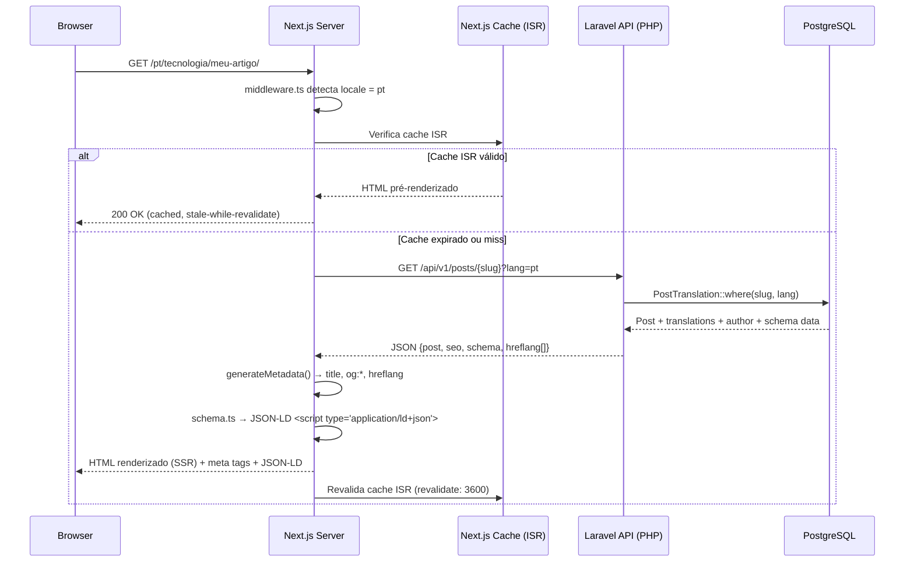
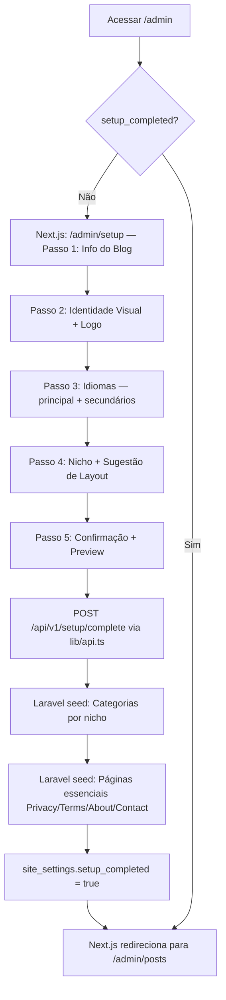
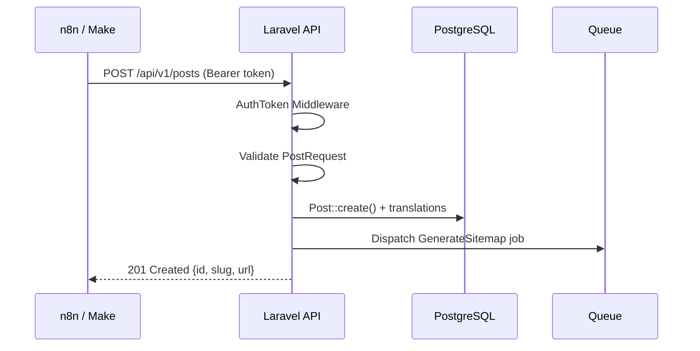
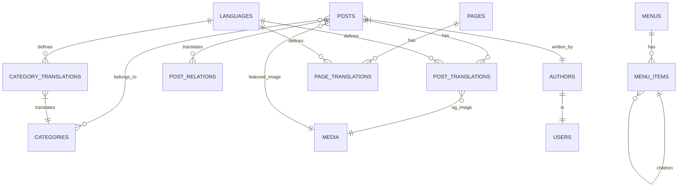

# ARQUITETURA E PLANO DE EXECUÇÃO
## Blog Profissional Multilíngue — v2.0
**Data:** 2026-02-21 | **Branch:** feature/arquitetura
**Stack:** PHP 8 (Laravel 11) — API Headless + Next.js 15 — Frontend Público + Admin

---

## 1. ANÁLISE COMPLETA DO PRD

### 1.1 Complexidade Geral

| Dimensão | Nível | Justificativa |
|---|---|---|
| Backend | **Alta** | CMS próprio, API REST, multilíngue, agendamento, roles |
| Frontend | **Alta** | GrapesJS integrado, drag-and-drop menus, múltiplos layouts |
| SEO/i18n | **Alta** | hreflang, sitemaps por idioma, schema markup JSON-LD |
| DevOps | **Alta** | Dois projetos independentes (PHP API + Next.js), CORS, Node.js em VPS obrigatório |
| Banco de dados | **Alta** | Modelo translatable, relações entre idiomas, hierarquias |

**Classificação geral: Projeto Complexo de Médio-Grande Porte**
Estimativa de desenvolvimento solo (senior): **16–24 semanas**
Estimativa com time de 2–3 devs: **8–12 semanas**

---

### 1.2 Módulos Identificados

1. **Setup Wizard** — pré-instalação guiada com nicho/idioma
2. **Auth & Users** — autenticação, perfis de autor, papéis
3. **Posts & Páginas** — CRUD, editor GrapesJS, status, agendamento
4. **Multilíngue (i18n Core)** — idiomas, slugs por idioma, relações entre traduções
5. **SEO Engine** — meta tags, Open Graph, hreflang, sitemap XML, robots.txt, schema JSON-LD
6. **Mídia Library** — upload, WebP/AVIF, alt por idioma, organização
7. **Menus & Navegação** — menus dinâmicos drag-and-drop, multi-nível
8. **Layouts & Temas** — 3 layouts, troca sem perda de conteúdo
9. **AdSense & Monetização** — blocos de anúncio configuráveis por idioma
10. **API REST** — endpoints externos para n8n/Make/scripts
11. **Conformidade Legal** — gerador de páginas essenciais (Privacidade, ToS, About, Contato)

---

### 1.3 Dependências Críticas entre Módulos

```
Setup Wizard
    └─► Auth & Users
            └─► Posts & Páginas
                    └─► Multilíngue (i18n Core)
                            ├─► SEO Engine
                            ├─► Menus & Navegação
                            └─► Sitemaps
Posts & Páginas
    └─► Editor GrapesJS
            └─► Mídia Library
SEO Engine
    └─► Schema JSON-LD
    └─► Sitemap XML
API REST
    └─► Posts & Páginas
    └─► Auth (token)
```

---

### 1.4 Riscos Identificados

| Código | Risco | Probabilidade | Impacto | Mitigação |
|---|---|---|---|---|
| R01 | Integração GrapesJS com backend pode gerar HTML não-semântico | Alta | Alto (SEO) | Sanitização e validação de output obrigatória |
| R02 | Performance em shared hosting com múltiplos idiomas e sitemaps | Média | Alto | Cache agressivo, sitemaps gerados em fila/background |
| R03 | Complexidade do modelo de dados multilíngue | Alta | Médio | Usar padrão de tabela `_translations` desde o início |
| R04 | Plugin GrapesJS vs. Core Web Vitals (JS pesado) | Média | Alto | GrapesJS apenas no painel admin, nunca no frontend público |
| R05 | Slug duplicado entre idiomas | Média | Médio | Slugs únicos por `(idioma, slug)` a nível de banco |
| R06 | Schema markup incorreto → penalidade Google | Média | Alto | Validação com Google Rich Results Test automatizada |
| R07 | Falta de HTTPS em shared hosting legado | Baixa | Alto | Let's Encrypt obrigatório no setup wizard |
| R08 | Scope creep no editor visual | Alta | Médio | Limitar MVP: GrapesJS básico, expandir depois |
| R09 | CORS mal configurado bloqueando chamadas Next.js → PHP API | Alta | Alto | Configurar `cors.php` no Laravel com origens restritas desde F0.1 |
| R10 | Shared hosting sem suporte a Node.js (Next.js exige runtime Node) | Alta | Alto | Next.js implantado na Vercel (frontend) + PHP API no shared hosting separado |
| R11 | Hidratação incorreta no Next.js (SSR vs. Client mismatch) | Média | Médio | Separar claramente Server Components e Client Components desde o início |

---

### 1.5 Pontos Críticos de SEO, i18n e AdSense

#### SEO
- `lang` attribute no `<html>` dinâmico por idioma
- `<link rel="canonical">` obrigatório em todas as páginas
- `<link rel="alternate" hreflang="x">` em todas as páginas com tradução
- Sitemap index + sitemaps individuais por idioma
- Schema `Article` + `BreadcrumbList` + `Author` + `Organization`
- URLs limpas: `/pt/categoria/slug-do-artigo/`

#### i18n
- Conteúdo independente por idioma (não forçar tradução)
- Fallback de idioma configurável
- Slugs localizados (ex: `/en/technology/` vs `/pt/tecnologia/`)
- Datas, números e moedas formatados por locale

#### AdSense
- Páginas obrigatórias: Privacy Policy, Terms of Service, About, Contact
- Design limpo sem pop-ups intrusivos
- Identificação clara de conteúdo patrocinado
- Blocos de anúncio com `data-ad-*` configuráveis por idioma/país

---

## 2. ARQUITETURA COMPLETA

### 2.1 Arquitetura Adotada — Decisão Definida no PRD v2.0

A arquitetura está **definida no PRD**: backend PHP 8 + frontend Next.js. O documento registra as duas alternativas avaliadas antes da decisão:

#### Alternativa A — Laravel (PHP 8) API Headless + Next.js 15 *(ADOTADA — PRD v2.0)*
- **Pontos positivos:** separação de responsabilidades clara, Next.js com SSR/ISR nativo leva vantagem real em Core Web Vitals, Metadata API nativa do Next.js para SEO, `next-intl` para i18n de rotas (`/pt/`, `/en/`), GrapesJS no painel admin React sem impacto no frontend público
- **Pontos negativos:** dois projetos para manter e deployar, CORS obrigatório, Next.js exige Node.js (VPS ou Vercel), maior complexidade de CI/CD

#### Alternativa B — Laravel + Inertia.js + Vue 3 (Monolito)
- **Descartada pelo PRD v2.0** — PRD define explicitamente Next.js como frontend

#### Decisão Arquitetural: **PHP 8 (Laravel 11) como API Headless + Next.js 15 como Frontend/Admin**
**Justificativa (PRD v2.0, Seção 3):** O sistema fica com backend Laravel (PHP 8) responsável exclusivamente pela API REST, persistência, filas, sitemaps, jobs e autenticação. O Next.js (App Router + TypeScript) consome a API e entrega o frontend público com SSR/ISR e o painel admin como SPA. A API PHP pode ser hospedada em shared hosting; o Next.js requer Node.js (Vercel ou VPS).

---

### 2.2 Visão Geral da Arquitetura

```
┌─────────────────────────────────────────────────────────────┐
│                        CLIENTE                              │
│  Browser (Visitor)          Browser (Admin)                 │
└────────────┬────────────────────────┬───────────────────────┘
             │ HTTPS                  │ HTTPS
             ▼                        ▼
┌─────────────────────────────────────────────────────────────┐
│             NEXT.JS 15 (Node.js — Vercel ou VPS)            │
│  App Router + TypeScript + next-intl + Tailwind CSS         │
│  ┌─────────────────────┐  ┌────────────────────────────┐   │
│  │ /[locale]/...       │  │ /admin/...                 │   │
│  │ Frontend Público    │  │ Painel Admin               │   │
│  │ Server Components   │  │ React + GrapesJS           │   │
│  │ SSR / ISR / SSG     │  │ Client Components SPA      │   │
│  └──────────┬──────────┘  └───────────┬────────────────┘   │
│             └──────────────┬──────────┘                     │
│                            │ REST API (HTTPS)               │
└────────────────────────────┼────────────────────────────────┘
                             │
                             ▼
┌─────────────────────────────────────────────────────────────┐
│       PHP 8 — LARAVEL 11 API (Shared Hosting ou VPS)        │
│  ┌────────────┐ ┌────────────────┐ ┌──────────────────────┐ │
│  │ API Layer  │ │   Services     │ │  Console / Queue     │ │
│  │ /api/v1/*  │ │ SeoService     │ │ GenerateSitemap      │ │
│  │ Sanctum    │ │ SchemaService  │ │ PublishScheduled     │ │
│  │ CORS config│ │ MediaService   │ │ cron schedule        │ │
│  └──────┬─────┘ └────────────────┘ └──────────────────────┘ │
│         │              Eloquent ORM                         │
└─────────┼───────────────────────────────────────────────────┘
          ▼
┌─────────────────────────────────────────────────────────────┐
│         PostgreSQL 15+          Redis (Cache + Queues)      │
└─────────────────────────────────────────────────────────────┘
          ▼
┌─────────────────────────────────────────────────────────────┐
│   STORAGE: Local Disk (shared hosting) / S3-compatible VPS  │
└─────────────────────────────────────────────────────────────┘
```

**Fronteiras de responsabilidade:**
- `next-intl` gerencia rotas localizadas (`/pt/`, `/en/`) e traduções de strings da UI no Next.js
- `hreflang`, `canonical`, `og:*`, schema JSON-LD são gerados nos **Server Components** do Next.js, consumindo dados da API PHP
- Sitemaps XML são gerados pelo **Laravel** (job assíncrono) e servidos em `/sitemap.xml`
- GrapesJS roda exclusivamente em **Client Components** dentro de `/admin` — nunca no frontend público

---

### 2.3 Módulos e Responsabilidades

#### Projeto 1 — Backend: `blog-api/` (Laravel 11, PHP 8.3)

```
blog-api/
├── app/
│   ├── Http/
│   │   ├── Controllers/Api/v1/  → PostController, PageController,
│   │   │                         CategoryController, MediaController,
│   │   │                         MenuController, AuthController,
│   │   │                         SettingController, SetupController
│   │   ├── Middleware/
│   │   │   ├── EnsureSetupComplete  → bloqueia API até setup finalizado
│   │   │   └── CheckApiToken        → valida Bearer token p/ rotas externas
│   │   └── Requests/            → FormRequests por recurso
│   ├── Models/              → Post, Page, Category, Author,
│   │                          Menu, MenuItem, Media, Language,
│   │                          SiteSetting, User
│   ├── Services/
│   │   ├── SeoService           → hreflang payload, canonical URL
│   │   ├── SitemapService       → gera XML sitemaps por idioma
│   │   ├── SchemaService        → JSON-LD Article, Author, Org
│   │   ├── MediaService         → upload, WebP/AVIF, storage
│   │   └── SetupService         → wizard, seed por nicho
│   ├── Jobs/
│   │   ├── GenerateSitemap      → job assíncrono pós-publish
│   │   └── PublishScheduled     → job p/ posts agendados
│   └── Console/Commands/
│       └── PublishPosts         → cron dispára Jobs acima
├── routes/api.php           → todas as rotas REST versionadas
└── config/cors.php          → CORS configurado com `allowed_origins`
```

#### Projeto 2 — Frontend: `blog-frontend/` (Next.js 15, TypeScript)

```
blog-frontend/
├── app/
│   ├── [locale]/              → i18n routing com next-intl
│   │   ├── page.tsx             → Homepage (Server Component, ISR)
│   │   ├── [category]/
│   │   │   └── [slug]/page.tsx   → Post page (SSR / ISR)
│   │   └── [...slug]/page.tsx  → Páginas estáticas
│   ├── admin/                 → Painel admin (autentica via Sanctum)
│   │   ├── posts/               → CRUD posts (Client Components)
│   │   ├── pages/               → CRUD páginas
│   │   ├── media/               → Biblioteca de mídia
│   │   ├── menus/               → Drag-and-drop menus
│   │   ├── settings/            → Configurações gerais
│   │   └── setup/               → Setup Wizard 5 passos
│   └── sitemap.ts             → Redireciona para /sitemap.xml do Laravel
├── components/
│   ├── public/                → PostCard, Breadcrumb, AuthorBox, AdBlock
│   ├── admin/                 → GrapesJSEditor, MediaPicker, MenuBuilder
│   └── layouts/               → Layout1Clean, Layout2Magazine, Layout3Minimal
├── lib/
│   ├── api.ts                 → Wrapper fetch para o Laravel API
│   ├── seo.ts                 → generateMetadata() helpers
│   └── schema.ts              → JSON-LD builders (Article, Breadcrumb)
├── i18n/                    → Arquivos de tradução da UI (JSON)
└── middleware.ts            → next-intl locale detection + /admin auth guard
```

---

### 2.4 Fluxo de Requisição Pública (SSR via Next.js)



---

### 2.5 Fluxo de Setup Wizard (Next.js → PHP API)



---

### 2.6 Fluxo da API REST (Automação)



---

## 3. MODELO DE DADOS

### 3.1 Estratégia de Multilinguagem

Padrão adotado: **Tabelas de tradução separadas (`_translations`)** compatível com `spatie/laravel-translatable` (JSON column) para campos simples, e tabelas relacionais para conteúdo extenso.

Para campos curtos (title, slug, meta_title, meta_description): **JSON column** em uma única tabela.
Para conteúdo extenso (body HTML do GrapesJS): **tabela `post_translations`** separada.

---

### 3.2 Tabelas Principais

#### `languages`
| Campo | Tipo | Observações |
|---|---|---|
| id | BIGINT PK | |
| code | VARCHAR(10) | ex: `pt`, `en`, `es` — UNIQUE |
| name | VARCHAR(100) | ex: "Português" |
| locale | VARCHAR(20) | ex: `pt_BR`, `en_US` |
| is_default | BOOLEAN | Apenas um pode ser true |
| is_active | BOOLEAN | |
| url_prefix | VARCHAR(10) | ex: `/pt/` — UNIQUE |
| created_at / updated_at | TIMESTAMP | |

---

#### `site_settings`
| Campo | Tipo | Observações |
|---|---|---|
| id | BIGINT PK | |
| key | VARCHAR(100) UNIQUE | ex: `site_name`, `primary_color` |
| value | TEXT | |
| type | VARCHAR(50) | string, json, boolean, file |
| group | VARCHAR(100) | general, seo, appearance, monetization |
| created_at / updated_at | TIMESTAMP | |

---

#### `authors`
| Campo | Tipo | Observações |
|---|---|---|
| id | BIGINT PK | |
| user_id | BIGINT FK → users | |
| name | VARCHAR(200) | |
| slug | VARCHAR(200) UNIQUE | |
| bio | JSON | `{"pt": "...", "en": "..."}` translatable |
| avatar | VARCHAR(500) | path relativo |
| social_links | JSON | `{"twitter": "", "linkedin": ""}` |
| schema_same_as | JSON | URLs para E-E-A-T |
| created_at / updated_at | TIMESTAMP | |

---

#### `categories`
| Campo | Tipo | Observações |
|---|---|---|
| id | BIGINT PK | |
| parent_id | BIGINT FK → categories | nullable, hierarquia |
| image | VARCHAR(500) | |
| sort_order | INT | |
| is_active | BOOLEAN | |
| created_at / updated_at | TIMESTAMP | |

#### `category_translations`
| Campo | Tipo | Observações |
|---|---|---|
| id | BIGINT PK | |
| category_id | BIGINT FK → categories | |
| language_code | VARCHAR(10) FK → languages | |
| name | VARCHAR(200) | |
| slug | VARCHAR(200) | UNIQUE com language_code |
| description | TEXT | |
| meta_title | VARCHAR(70) | |
| meta_description | VARCHAR(160) | |
| UNIQUE | (category_id, language_code) | |

---

#### `posts`
| Campo | Tipo | Observações |
|---|---|---|
| id | BIGINT PK | |
| author_id | BIGINT FK → authors | |
| featured_image | BIGINT FK → media | |
| status | ENUM(draft, scheduled, published, archived) | |
| published_at | TIMESTAMP | nullable |
| scheduled_at | TIMESTAMP | nullable |
| reading_time | SMALLINT | minutos (calculado) |
| allow_comments | BOOLEAN | |
| created_at / updated_at | TIMESTAMP | |

#### `post_translations`
| Campo | Tipo | Observações |
|---|---|---|
| id | BIGINT PK | |
| post_id | BIGINT FK → posts | |
| language_code | VARCHAR(10) FK → languages | |
| title | VARCHAR(300) | |
| slug | VARCHAR(300) | |
| excerpt | TEXT | |
| body | LONGTEXT | HTML do GrapesJS (sanitizado) |
| grapesjs_data | JSON | estado interno do editor GrapesJS |
| meta_title | VARCHAR(70) | |
| meta_description | VARCHAR(160) | |
| og_title | VARCHAR(160) | |
| og_image | BIGINT FK → media | nullable |
| schema_custom | JSON | override de schema por post |
| UNIQUE | (post_id, language_code) | |
| INDEX | slug, language_code | |

---

#### `post_categories` (pivot)
| Campo | Tipo |
|---|---|
| post_id | BIGINT FK |
| category_id | BIGINT FK |
| PRIMARY KEY | (post_id, category_id) |

---

#### `post_relations` (traduções do mesmo conteúdo)
| Campo | Tipo | Observações |
|---|---|---|
| id | BIGINT PK | |
| original_post_id | BIGINT FK → posts | post de origem |
| translated_post_id | BIGINT FK → posts | post traduzido |
| language_code | VARCHAR(10) | idioma do post traduzido |
| UNIQUE | (original_post_id, language_code) | |

> **Observação:** Posts são entidades independentes por idioma. Esta tabela liga opcionalmente posts de conteúdo equivalente entre idiomas, sem forçar vinculação.

---

#### `pages`
| Campo | Tipo | Observações |
|---|---|---|
| id | BIGINT PK | |
| type | ENUM(custom, privacy, terms, about, contact) | Tipo especial para páginas essenciais |
| is_system | BOOLEAN | Impede exclusão de páginas do sistema |
| status | ENUM(draft, published) | |
| created_at / updated_at | TIMESTAMP | |

#### `page_translations`
| Campo | Tipo | Observações |
|---|---|---|
| id | BIGINT PK | |
| page_id | BIGINT FK → pages | |
| language_code | VARCHAR(10) | |
| title | VARCHAR(300) | |
| slug | VARCHAR(300) | |
| body | LONGTEXT | HTML GrapesJS |
| grapesjs_data | JSON | |
| meta_title | VARCHAR(70) | |
| meta_description | VARCHAR(160) | |
| UNIQUE | (page_id, language_code) | |

---

#### `media`
| Campo | Tipo | Observações |
|---|---|---|
| id | BIGINT PK | |
| filename | VARCHAR(500) | nome original |
| disk_path | VARCHAR(1000) | caminho no storage |
| webp_path | VARCHAR(1000) | versão WebP gerada |
| avif_path | VARCHAR(1000) | versão AVIF gerada |
| mime_type | VARCHAR(100) | |
| size_bytes | INT | |
| width / height | SMALLINT | para imagens |
| folder | VARCHAR(300) | organização por pastas |
| tags | JSON | |
| alt_text | JSON | `{"pt": "...", "en": "..."}` |
| title | JSON | translatable |
| uploaded_by | BIGINT FK → users | |
| created_at / updated_at | TIMESTAMP | |

---

#### `menus`
| Campo | Tipo | Observações |
|---|---|---|
| id | BIGINT PK | |
| name | VARCHAR(100) | ex: "Menu Principal" |
| location | VARCHAR(100) UNIQUE | ex: header, footer-left |
| language_code | VARCHAR(10) | nullable = global |
| created_at / updated_at | TIMESTAMP | |

#### `menu_items`
| Campo | Tipo | Observações |
|---|---|---|
| id | BIGINT PK | |
| menu_id | BIGINT FK → menus | |
| parent_id | BIGINT FK → menu_items | nullable |
| label | JSON | `{"pt": "Início", "en": "Home"}` |
| linkable_type | VARCHAR(200) | nullable (Post, Page, Category) |
| linkable_id | BIGINT | nullable |
| custom_url | VARCHAR(500) | nullable |
| target | ENUM(_self, _blank) | |
| sort_order | INT | |
| created_at / updated_at | TIMESTAMP | |

---

#### `users`
| Campo | Tipo | Observações |
|---|---|---|
| id | BIGINT PK | |
| name | VARCHAR(200) | |
| email | VARCHAR(200) UNIQUE | |
| password | VARCHAR(500) | bcrypt |
| role | ENUM(superadmin, admin, editor, contributor) | |
| api_token | VARCHAR(80) | nullable, hashed |
| remember_token | VARCHAR(100) | |
| created_at / updated_at | TIMESTAMP | |

---

### 3.3 Diagrama ER Simplificado



---

## 4. PLANO DE EXECUÇÃO

> **Nota sobre a nova stack:** A arquitetura desacoplada (PHP API + Next.js) divide o trabalho em dois projetos paralelos com fronteiras bem definidas. As fases 0–2 focam no backend (Laravel API), as fases 3–5 no frontend (Next.js), e as fases 6–8 na integração, performance e deploy dos dois projetos juntos.

### 4.1 Visão por Fases

```
Fase 0 → Fundação — Dois Projetos + Banco + Auth (2 semanas)
Fase 1 → Core API Backend (Laravel) (3 semanas)
Fase 2 → Multilíngue + SEO Engine no Backend (3 semanas)
Fase 3 → Mídia API + Editor GrapesJS (Next.js Admin) (2 semanas)
Fase 4 → Painel Admin em Next.js (3 semanas)
Fase 5 → Frontend Público Next.js (SSR/ISR + 3 layouts) (3 semanas)
Fase 6 → API REST Pública + Automação (1 semana)
Fase 7 → AdSense + Conformidade + Performance (2 semanas)
Fase 8 → Testes, Deploy e Documentação (2 semanas)
─────────────────────────────────────────────────────────
Total estimado: 21 semanas (solo developer)
MVP (Fase 0 + 1 + 2 + 4 + 5): ~13 semanas
```

---

### FASE 0 — Fundação (Dois Projetos + Banco + Auth)
**Critério de conclusão:** `blog-api` respondendo com JSON em `/api/v1/health`, `blog-frontend` renderizando página vazia em `localhost:3000`, banco migrado, CORS funcional, login via Sanctum retornando token.

| # | Tarefa | Subtarefas | Dependências |
|---|---|---|---|
| F0.1 | Setup `blog-api` (Laravel) | `laravel new blog-api --api`, `.env` com PostgreSQL + Redis, `APP_URL` | — |
| F0.2 | Migrations base | Todas as tabelas do modelo de dados (seção 3) | F0.1 |
| F0.3 | Autenticação API (Sanctum) | `laravel/sanctum`, endpoint `POST /api/v1/auth/login`, roles (superadmin, admin, editor), geração de `api_token` | F0.1 |
| F0.4 | CORS configurado | `config/cors.php`: orıgens restritas (`FRONTEND_URL`), headers `Authorization` e `Content-Type` liberados | F0.1 |
| F0.5 | Setup `blog-frontend` (Next.js) | `npx create-next-app@latest blog-frontend --typescript --app --tailwind`, configurar `NEXT_PUBLIC_API_URL` | — |
| F0.6 | Cliente API no Next.js | `lib/api.ts`: wrapper `fetch` com interceptor de token, tipagens TypeScript dos recursos | F0.3, F0.5 |
| F0.7 | Auth guard Admin (Next.js) | `middleware.ts` redireciona `/admin/*` para `/admin/login` se não autenticado; cookies httpOnly via Sanctum SPA | F0.5, F0.3 |
| F0.8 | Middleware `EnsureSetupComplete` | Bloqueia todos endpoints exceto `/api/v1/setup/*` até `setup_completed = true` no `site_settings` | F0.2 |

---

### FASE 1 — Core API Backend (Laravel)
**Critério de conclusão:** Todos os endpoints CRUD de posts, páginas, categorias e autores respondendo corretamente com paginação, validação e API Resources.

| # | Tarefa | Subtarefas | Dependências |
|---|---|---|---|
| F1.1 | API Resource base | `PostResource`, `PageResource`, `CategoryResource` com campos SEO e translatable | F0.2 |
| F1.2 | CRUD Posts (API) | `PostController@index,show,store,update,destroy`, FormRequest, filtros por status/idioma/categoria | F1.1 |
| F1.3 | CRUD Páginas Estáticas (API) | Similar ao F1.2, tipos especiais (system pages: privacy, terms, about, contact) | F1.1 |
| F1.4 | CRUD Categorias (API) | Com hierarquia (`parent_id`), translatable via `post_translations` pattern | F1.1 |
| F1.5 | Gestão de Autores (API) | Perfil, bio JSON multilíngue, avatar (path), social_links, schema_same_as | F0.3, F0.2 |
| F1.6 | CRUD Menus + MenuItems (API) | Endpoints para menus e itens, suporte polimórfico (`linkable_type/id`), reordenação | F1.2, F1.3, F1.4 |
| F1.7 | Agendamento de Posts | Job `PublishScheduled`, `schedule()` no Kernel, campo `scheduled_at`, `POST /api/v1/posts/{id}/schedule` | F1.2 |
| F1.8 | API Resources com paginação | Paginação consistente em todos os `index` endpoints, `meta.total`, `links.next` | F1.2–F1.5 |

---

### FASE 2 — Multilíngue + SEO Engine no Backend
**Critério de conclusão:** API retornando dados de hreflang, schema JSON-LD e sitemaps XML por idioma; endpoint de robots.txt funcionando.

| # | Tarefa | Subtarefas | Dependências |
|---|---|---|---|
| F2.1 | CRUD Idiomas (API) | `GET/POST/PATCH /api/v1/languages`, definir padrão, ativar/desativar | F0.2 |
| F2.2 | Suporte a traduções na API de Posts | `POST /api/v1/posts/{id}/translations`, update parcial por idioma, `post_relations` opcional | F1.2, F2.1 |
| F2.3 | SeoService | `buildHreflangPayload()`, `buildCanonicalUrl()`, `buildOpenGraph()` — retornados como objeto no JSON do post | F2.1 |
| F2.4 | SchemaService | `buildArticleSchema()`, `buildBreadcrumbSchema()`, `buildAuthorSchema()`, `buildOrgSchema()` — retornados no JSON | F1.5, F2.3 |
| F2.5 | SitemapService | `GenerateSitemap` job: gera `/public/sitemap.xml` (index) + `/public/sitemap-{lang}.xml` por idioma; disparado no publish | F2.1, F2.3 |
| F2.6 | Endpoint `GET /sitemap.xml` | Serves sitemap gerado ou force-regenera se desatualizado | F2.5 |
| F2.7 | Endpoint `GET /robots.txt` | Gerado dinamicamente a partir de `site_settings.robots_txt_content` | F0.2 |
| F2.8 | API de Configurações Globais SEO | `GET/PATCH /api/v1/settings` com grupo `seo`: title pattern, site name, default og:image | F0.2 |

---

### FASE 3 — Mídia API + Editor GrapesJS (Next.js Admin)
**Critério de conclusão:** Upload de imagem via API PHP retornando URLs WebP/AVIF; componente GrapesJS salvando `body` HTML sanitizado e `grapesjs_data` JSON na API.

| # | Tarefa | Subtarefas | Dependências |
|---|---|---|---|
| F3.1 | Upload de mídia (API PHP) | `POST /api/v1/media`, validação MIME real, storage local ou S3, retorna `{id, url, webp_url}` | F0.3 |
| F3.2 | Conversão WebP/AVIF (Job) | `spatie/image` ou `Intervention Image`, job assíncrono pós-upload, atualiza `webp_path`/`avif_path` | F3.1 |
| F3.3 | Alt text multilíngue (API) | `PATCH /api/v1/media/{id}`: atualiza `alt_text` JSON por idioma | F3.1, F2.1 |
| F3.4 | Componente GrapesJS (Next.js) | `components/admin/GrapesJSEditor.tsx` (`'use client'`), plugins drag-and-drop, salva `body` + `grapesjs_data` via `lib/api.ts` | F1.2, F0.5 |
| F3.5 | Sanitização no save (PHP) | `HTMLPurifier` aplicado no `PostController@store/update` antes de persistir `body` | F3.4, F1.2 |
| F3.6 | MediaPicker modal (Next.js) | `components/admin/MediaPicker.tsx`: grid de mídia, pesquisa por nome/tag, URL inserida no GrapesJS | F3.1, F3.4 |

---

### FASE 4 — Painel Admin em Next.js
**Critério de conclusão:** Todas as telas do admin funcionando (CRUD posts, páginas, categorias, autores, menus, mídias, configurações) com GrapesJS integrado e Setup Wizard completo.

| # | Tarefa | Subtarefas | Dependências |
|---|---|---|---|
| F4.1 | Setup Wizard 5 passos (Next.js) | `/admin/setup/`: coleta info do blog → identidade visual → idiomas → nicho/layout → confirmação; chama `POST /api/v1/setup/complete` | F0.7, F2.1 |
| F4.2 | Listagem e CRUD de Posts (Admin) | `/admin/posts/`: tabela com filtros, `/admin/posts/new` e `/admin/posts/[id]/edit` com GrapesJS + abas por idioma | F3.4, F1.2, F2.2 |
| F4.3 | CRUD Páginas Estáticas (Admin) | `/admin/pages/`: similar ao F4.2, com indicador de tipo (system page) | F1.3, F3.4 |
| F4.4 | CRUD Categorias (Admin) | `/admin/categories/`: tabela hierárquica, formulário com campos translatable por idioma | F1.4 |
| F4.5 | Gestão de Autores (Admin) | `/admin/authors/`: formulário com bio multilíngue, upload de avatar via MediaPicker | F1.5, F3.6 |
| F4.6 | Gestão de Menus (Admin) | `/admin/menus/`: `@hello-pangea/dnd` ou `dnd-kit` para drag-and-drop, vinculação polimórfica | F1.6 |
| F4.7 | Biblioteca de Mídia (Admin) | `/admin/media/`: grid, upload direto para API PHP, edição de alt text por idioma | F3.1, F3.6 |
| F4.8 | Configurações Gerais (Admin) | `/admin/settings/`: grupos general, seo, appearance (layout ativo), monetization (AdSense ID por idioma) | F2.8 |
| F4.9 | Gestão de Idiomas (Admin) | `/admin/languages/`: CRUD, definir padrão, ativar/desativar | F2.1 |

---

### FASE 5 — Frontend Público Next.js (SSR/ISR + Layouts)
**Critério de conclusão:** 3 layouts renderizando no frontend público com SSR, hreflang correto no `<head>`, schema JSON-LD, ISR com revalidation, lazy loading e paginação SEO-friendly.

| # | Tarefa | Subtarefas | Dependências |
|---|---|---|---|
| F5.1 | Configurar `next-intl` + App Router | `i18n.ts`, `middleware.ts`, `[locale]` routing, fallback de idioma, `generateStaticParams` | F0.5, F2.1 |
| F5.2 | `generateMetadata()` global | `lib/seo.ts`: monta `title`, `description`, `canonical`, `alternates.languages` (hreflang), `openGraph`, `twitter` | F2.3, F5.1 |
| F5.3 | JSON-LD Server Components | `lib/schema.ts` + `<script type="application/ld+json">`: Article, BreadcrumbList, Author, Organization | F2.4, F5.1 |
| F5.4 | Layout 1: Editorial Clean | `components/layouts/Layout1Clean.tsx`: Header, Hero, Grid de cards 3 colunas, Sidebar, Footer | F5.1 |
| F5.5 | Layout 2: Magazine | `components/layouts/Layout2Magazine.tsx`: Multi-coluna, featured post em destaque, grid secundário | F5.1 |
| F5.6 | Layout 3: Minimal Blog | `components/layouts/Layout3Minimal.tsx`: lista simples, foco em leitura, sem sidebar | F5.1 |
| F5.7 | Componentes reutilizáveis | `PostCard`, `CategoryBadge`, `AuthorBox`, `Breadcrumb`, `Pagination` | F5.4–F5.6 |
| F5.8 | Rotas de conteúdo | `[locale]/page.tsx` (home ISR), `[locale]/[category]/[slug]/page.tsx` (post ISR), `[locale]/[...slug]/page.tsx` (páginas) | F5.1–F5.3 |
| F5.9 | ISR e revalidação | `revalidate: 3600` em páginas de post; `revalidatePath` disparado via webhook do Laravel ao publicar | F5.8, F1.7 |
| F5.10 | Lazy loading e `<picture>` | `next/image` com `sizes`, `placeholder="blur"`, formatos WebP/AVIF via `formats` do Next.js | F5.7 |
| F5.11 | Paginação SEO-friendly | `rel="canonical"` por página, `noindex` em profundidade > 5, query param `?page=N` | F5.8 |
| F5.12 | Troca de layout via setting | `SiteSetting.active_layout` lido em Server Component root — sem perda de conteúdo | F4.8, F5.4–F5.6 |

---

### FASE 6 — API REST Pública + Automação
**Critério de conclusão:** Endpoints de automação documentados e testados com n8n; webhook de revalidação Next.js funcional.

| # | Tarefa | Subtarefas | Dependências |
|---|---|---|---|
| F6.1 | Endpoint externo: Criar post | `POST /api/v1/posts` com Bearer token de automação, idioma, conteúdo, status | F1.2, F0.3 |
| F6.2 | Endpoint externo: Atualizar post | `PUT /api/v1/posts/{id}`, update parcial por idioma | F6.1 |
| F6.3 | Endpoint externo: Publicar post | `PATCH /api/v1/posts/{id}/publish` → dispara `GenerateSitemap` + webhook revalidação | F6.1, F5.9 |
| F6.4 | Endpoint externo: Upload mídia | `POST /api/v1/media` com Bearer token | F3.1, F0.3 |
| F6.5 | Webhook de revalidação ISR | `POST /api/v1/revalidate` no Next.js (com `REVALIDATE_SECRET`) disparado pelo Laravel ao publicar | F5.9, F6.3 |
| F6.6 | Rate limiting + throttle | `throttle:60,1` nas rotas de API pública, `throttle:10,1` no upload | F0.3 |
| F6.7 | Documentação da API | `openapi.yaml` ou `docs/api.md` com exemplos para n8n/Make | F6.1–F6.5 |

---

### FASE 7 — AdSense + Conformidade + Performance
**Critério de conclusão:** Core Web Vitals aprovados localmente (Lighthouse ≥ 90), páginas essenciais geradas, blocos AdSense configuráveis por idioma, HTTPS enforçado.

| # | Tarefa | Subtarefas | Dependências |
|---|---|---|---|
| F7.1 | Gerador de páginas essenciais | Seed via `SetupService`: cria `pages` do tipo privacy, terms, about, contact com templates i18n | F1.3, F2.1 |
| F7.2 | Formulário de contato (Next.js) | Componente React com honeypot anti-spam, chama `POST /api/v1/contact` no Laravel (envia e-mail via SMTP) | F1.3 |
| F7.3 | Componente AdSense (Next.js) | `components/public/AdBlock.tsx` (`'use client'`): carrega `adsbygoogle` por idioma/posição, configurável via `SiteSetting` | F5.4–F5.6 |
| F7.4 | Build e otimização Next.js | `next build` com análise de bundle (`@next/bundle-analyzer`), remoção de imports desnecessários | F5.1–F5.12 |
| F7.5 | Compressão Gzip/Brotli | Configuração Nginx no VPS; Vercel faz automaticamente | F0.5 |
| F7.6 | Auditoria Core Web Vitals | Lighthouse CI no GitHub Actions: LCP < 2.5s, CLS < 0.1, INP < 200ms | F5.1–F5.12 |
| F7.7 | HTTPS + HSTS (Laravel API) | Redirect HTTP → HTTPS, header `Strict-Transport-Security`, `ForceScheme` middleware | F0.1 |
| F7.8 | Segurança API | CORS restrito, CSP headers, Sanctum token rotation, `X-Content-Type-Options`, SQL via Eloquent | F0.4 |

---

### FASE 8 — Testes, Deploy e Documentação
**Critério de conclusão:** `blog-api` deployado em shared hosting ou VPS, `blog-frontend` deployado na Vercel ou VPS Node.js, testes passando, documentação entregue.

| # | Tarefa | Subtarefas | Dependências |
|---|---|---|---|
| F8.1 | Testes unitários (PHP) | PHPUnit: `SeoService`, `SchemaService`, `SitemapService`, `MediaService` | F2.3–F2.5 |
| F8.2 | Testes de feature (PHP) | Laravel Feature Tests: todos os endpoints CRUD, auth, rate limit | F1.2–F1.8, F6.1–F6.5 |
| F8.3 | Testes Next.js | Jest + React Testing Library: componentes de layout, `generateMetadata`, schema helpers | F5.2–F5.8 |
| F8.4 | GitHub Actions — CI | Lint + tests na PR: `phpunit` para API, `jest` para Next.js | F8.1–F8.3 |
| F8.5 | Deploy `blog-api` (Shared Hosting) | rsync/FTP, `public/` como webroot PHP, cron `schedule:run`, migrations `--force` | F8.4 |
| F8.6 | Deploy `blog-api` (VPS alternativo) | Nginx + PHP-FPM, Supervisor para queues, Let's Encrypt, Redis | F8.4 |
| F8.7 | Deploy `blog-frontend` (Vercel) | `vercel --prod`, variáveis `NEXT_PUBLIC_API_URL`, `REVALIDATE_SECRET` | F8.4 |
| F8.8 | Deploy `blog-frontend` (VPS alternativo) | PM2 + Nginx reverse proxy para Node.js porta 3000 | F8.4 |
| F8.9 | Documentação técnica | `README.md` (ambos projetos), guia de configuração, `docs/api.md` | All |

---

## 5. CHECKLIST TÉCNICO

### 5.1 Backend (Laravel 11 — API Headless)
- [ ] PHP >= 8.2 com extensões: `intl`, `gd`/`imagick`, `redis`, `mbstring`
- [ ] Laravel Sanctum configurado: `stateful_domains`, `session.domain`, cookie `httponly`
- [ ] `spatie/laravel-translatable` ou colunas JSON nativas para campos curtos
- [ ] `spatie/image` para conversão WebP/AVIF assíncrona
- [ ] `HTMLPurifier` para sanear output do GrapesJS antes de persistir
- [ ] `config/cors.php`: `allowed_origins` com URL exata do Next.js (não `*`)
- [ ] Filas configuradas (Redis + Horizon em VPS, database driver em shared hosting)
- [ ] Cron: `* * * * * php artisan schedule:run`
- [ ] Rate limiting: `throttle:60,1` nas rotas de API, `throttle:10,1` no upload
- [ ] `AuthToken` em tabela separada, hash SHA-256, rotação via `PATCH /api/v1/auth/rotate`
- [ ] Todos os endpoints retornam `Content-Type: application/json`
- [ ] Logging estruturado (Laravel Telescope em dev, stack log em prod)
- [ ] `.env` com `APP_ENV=production`, `APP_DEBUG=false`, `APP_URL` correto

### 5.2 Frontend (Next.js 15 + TypeScript)
- [ ] Next.js 15 com App Router e TypeScript estrito (`strict: true`)
- [ ] `next-intl` configurado: `[locale]` routing, `middleware.ts`, `i18n/messages/pt.json`, `en.json`...
- [ ] `generateMetadata()` em todas as rotas públicas: `title`, `description`, `canonical`, `alternates.languages`, `openGraph`, `twitter`
- [ ] JSON-LD em `<script type="application/ld+json">` via Server Components (sem `'use client'`)
- [ ] GrapesJS instanciado apenas em `'use client'` components dentro de `/admin` — nunca importado em Server Components
- [ ] `next/image` com `sizes`, `placeholder="blur"`, `formats: ['image/avif', 'image/webp']` no `next.config.ts`
- [ ] `loading="lazy"` implícito via `next/image`; hero image com `priority={true}`
- [ ] ISR com `revalidate` adequado por rota; webhook `revalidatePath` chamado pelo Laravel ao publicar
- [ ] `@hello-pangea/dnd` ou `dnd-kit` para drag-and-drop de menus no admin
- [ ] Tailwind CSS 4 com `purge` configurado, `font-display: swap` na fontface
- [ ] `middleware.ts`: locale detection + redirect `/admin` para login se sem cookie de sessão Sanctum
- [ ] Bundle analyzer: `@next/bundle-analyzer` validado pré-deploy
- [ ] `NEXT_PUBLIC_API_URL` e `REVALIDATE_SECRET` como variáveis de ambiente (não hardcoded)

### 5.3 Banco de Dados
- [ ] PostgreSQL >= 14 (recomendado 15+) — `jsonb` para campos translatable, `citext` para slugs
- [ ] Extensões recomendadas: `pg_trgm`, `unaccent`, `citext`
- [ ] UTF-8 (padrão PostgreSQL) em todas as bases
- [ ] Índices em: `(slug, language_code)` (use `citext` para case-insensitive), `status`, `published_at`, `author_id`
- [ ] Full-text search via `tsvector` + GIN index em `post_translations.title` e `post_translations.body` (futuro)
- [ ] Backups automáticos diários via `pg_dump`/dump strategy configurados

### 5.4 SEO
- [ ] `<html lang="{locale}">` dinâmico
- [ ] `<link rel="canonical" href="...">` em toda página
- [ ] `<link rel="alternate" hreflang="...">` para cada idioma disponível
- [ ] Meta robots `noindex` em: paginação profunda, drafts, busca interna
- [ ] Schema JSON-LD: `Article`, `BreadcrumbList`, `Author`, `Organization`
- [ ] Sitemap index: `/sitemap.xml` → `/sitemap-pt.xml`, `/sitemap-en.xml`...
- [ ] Sitemap com `<lastmod>`, `<changefreq>`, `<priority>`
- [ ] Open Graph: `og:title`, `og:description`, `og:image`, `og:locale`
- [ ] Twitter Cards: `twitter:card`, `twitter:title`, `twitter:image`
- [ ] Paginação: `<link rel="prev/next">` (ou `rel="canonical"` por page)
- [ ] Breadcrumbs visíveis + schema BreadcrumbList
- [ ] URLs: sem trailing slash duplo, sem parâmetros desnecessários, minúsculas

### 5.5 Performance (Core Web Vitals)
- [ ] LCP < 2.5s: imagem hero com `loading="eager"` e `fetchpriority="high"`
- [ ] CLS < 0.1: dimensões explícitas em todos os `` e `<video>`
- [ ] FID/INP < 100ms: sem JS pesado no critical path do frontend público
- [ ] TTFB < 600ms: cache de resposta HTTP para páginas públicas
- [ ] Gzip/Brotli habilitado no servidor
- [ ] CSS crítico inline ou deferido
- [ ] JS diferido com `defer` ou carregado no final do `<body>`
- [ ] Font display: `font-display: swap`
- [ ] Imagens com dimensões explícitas (width/height attributes)

### 5.6 Segurança
- [ ] HTTPS obrigatório + HSTS (`Strict-Transport-Security`)
- [ ] CSRF protection (nativo Laravel) em todos os formulários
- [ ] Content Security Policy (CSP) header
- [ ] X-Frame-Options: SAMEORIGIN
- [ ] X-Content-Type-Options: nosniff
- [ ] Input sanitization em todos os campos
- [ ] Prepared statements (Eloquent ORM, sem raw queries não sanitizadas)
- [ ] Honeypot no formulário de contato
- [ ] Uploads: validação de tipo MIME real (não apenas extensão), armazenar fora do webroot
- [ ] `.env` nunca commitado, `.env.example` bem documentado
- [ ] Permissões de arquivo: `storage/` e `bootstrap/cache/` com 755

### 5.7 Deploy
**`blog-api` (Laravel PHP):**
- [ ] Shared hosting: `public/` como webroot PHP, `.htaccess` correto, cron `schedule:run` via cPanel
- [ ] VPS: Nginx + PHP-FPM 8.3, Supervisor para queues, Let's Encrypt via Certbot
- [ ] `php artisan config:cache && route:cache && view:cache` em produção
- [ ] `storage:link` executado após cada deploy
- [ ] Migrations com `--force` em produção
- [ ] Variáveis de ambiente definidas no servidor (não no repositório)
- [ ] `FRONTEND_URL` no `.env` apontando para a URL do Next.js (usado no CORS)

**`blog-frontend` (Next.js):**
- [ ] Vercel (recomendado): `vercel --prod`, variáveis `NEXT_PUBLIC_API_URL`, `REVALIDATE_SECRET` no painel
- [ ] VPS alternativo: Node.js >= 20, PM2 (`pm2 start npm -- start`), Nginx reverse proxy porta 3000
- [ ] `next build` sem erros de TypeScript e sem warnings de lint
- [ ] `NEXT_PUBLIC_API_URL` deve apontar para a URL pública do `blog-api`
- [ ] Caching headers configurados no Nginx/Vercel para assets estáticos (`/_next/static/*`)
- [ ] Monitoramento básico de uptime configurado (ambos os projetos)

---

## 6. RECOMENDAÇÃO FINAL

### 6.1 Stack Definitiva (PRD v2.0)

```
┌─────────────────────────────────────────────────────────────────────┐
│                     STACK FINAL — PRD v2.0                          │
├──────────────────────┬──────────────────────────────────────────────┤
│ Backend (blog-api)   │ Laravel 11 — PHP 8.3 (API Headless, REST)    │
│ Auth API             │ Laravel Sanctum (SPA + Bearer token)         │
│ ORM / Banco          │ Eloquent + PostgreSQL 15+                    │
│ Cache / Queue        │ Redis + Horizon (VPS) / DB driver (shared)   │
│ Imagens              │ spatie/image → WebP + AVIF (job assíncrono)  │
│ Sanitização HTML     │ HTMLPurifier (PHP, server-side)              │
│ Sitemaps             │ Gerados pelo Laravel, servidos em /sitemap.xml│
├──────────────────────┼──────────────────────────────────────────────┤
│ Frontend (blog-front)│ Next.js 15 — TypeScript (App Router)         │
│ i18n Routing         │ next-intl ([locale] routing)                 │
│ Estilo               │ Tailwind CSS 4                               │
│ Editor Visual        │ GrapesJS (Client Component, somente /admin)  │
│ Drag-and-drop menus  │ @hello-pangea/dnd ou dnd-kit                 │
│ Imagens              │ next/image (WebP/AVIF automático)            │
│ Build                │ Turbopack (dev) / next build (prod)          │
├──────────────────────┼──────────────────────────────────────────────┤
│ Storage              │ Local (shared hosting) / MinIO ou S3 (VPS)  │
│ Deploy API           │ Shared hosting PHP ou VPS (Nginx + PHP-FPM)  │
│ Deploy Frontend      │ Vercel (recomendado) ou VPS Node.js (PM2)    │
│ CI/CD                │ GitHub Actions: lint + tests + deploy        │
└──────────────────────┴──────────────────────────────────────────────┘
```

---

### 6.2 Melhor Abordagem de Deploy

**`blog-api` — Shared Hosting (mínimo viável):**
```
Domínio API: api.meublog.com → public_html/blog-api/public/
    └─ PHP 8.3 via cPanel
    └─ Cron: */1 * * * * php /home/user/blog-api/artisan schedule:run
    └─ PostgreSQL + Database queue driver (Redis não disponível)
    └─ CORS: FRONTEND_URL=https://meublog.com
    └─ Storage: local disk (imagens públicas via storage:link)
```

**`blog-api` — VPS (recomendado para produção):**
```
Nginx → PHP-FPM 8.3 → Porta 443 (Let's Encrypt via Certbot)
    └─ PostgreSQL 15+ + Redis 7
    └─ Supervisor → Laravel Horizon (queue workers)
    └─ Cron via crontab do sistema
    └─ Backup: `pg_dump` diário via GitHub Actions ou cron
```

**`blog-frontend` — Vercel (recomendado):**
```
Vercel (Edge Network global)
    └─ Deploy automático ao push na branch main
    └─ Variáveis: NEXT_PUBLIC_API_URL, REVALIDATE_SECRET
    └─ ISR: stale-while-revalidate gerenciado pela Vercel
    └─ HTTPS automático + CDN para assets estáticos
```

**`blog-frontend` — VPS Node.js (alternativo):**
```
Nginx reverse proxy → PM2 (Node.js 20) → Porta 3000
    └─ pm2 start npm --name blog-frontend -- start
    └─ Nginx proxy_pass http://localhost:3000
    └─ Let's Encrypt para HTTPS
```

---

### 6.3 Riscos Críticos (Top 4)

| Prioridade | Risco | Ação Imediata |
|---|---|---|
| 🔴 CRÍTICO | CORS bloqueando Next.js → PHP API | Configurar `cors.php` com `allowed_origins` exatos em **F0.4** antes de qualquer desenvolvimento de frontend |
| 🔴 CRÍTICO | GrapesJS gerando HTML não-semântico, quebrando SEO | `HTMLPurifier` obrigatório em **F3.5** no `PostController` antes de qualquer publicação |
| 🔴 CRÍTICO | Next.js em shared hosting (Node.js indisponível) | Frontend **obrigatoriamente** na Vercel ou VPS com Node.js — não há workaround para shared hosting |
| 🟡 ALTO | Hidratação SSR/Client mismatch no Next.js | Separar rigorosamente Server Components e `'use client'` desde **F0.5**; nunca usar `window` em Server Components |

---

### 6.4 Prioridades de Desenvolvimento

```
Semana 1–2:  Fase 0 — Dois projetos + banco + CORS + auth funcionando
Semana 3–4:  Fase 1 (F1.1–F1.5) — Core API: CRUD Posts + Páginas + Autores
Semana 5:    Fase 1 (F1.6–F1.8) + Fase 2 (F2.1–F2.3) — Menus + Idiomas
Semana 6:    Fase 2 (F2.4–F2.8) — SeoService + SchemaService + Sitemaps
Semana 7:    Fase 3 — Mídia API + GrapesJS no Next.js Admin
Semana 8–9:  Fase 4 (F4.1–F4.6) — Painel Admin Next.js (CRUD)
Semana 10:   Fase 4 (F4.7–F4.9) — Mídia, Configurações, Idiomas no admin
Semana 11:   Fase 5 (F5.1–F5.3) — next-intl + generateMetadata + JSON-LD
Semana 12–13:Fase 5 (F5.4–F5.12) — 3 layouts + ISR + lazy loading
Semana 14:   Fase 6 — API REST pública + webhook revalidação ISR
Semana 15:   Fase 7 (F7.1–F7.4) — AdSense + páginas essenciais + contato
Semana 16:   Fase 7 (F7.5–F7.8) — Performance + Core Web Vitals + Segurança
Semana 17–18:Fase 8 — Testes + CI/CD + Deploy + Docs

MVP (F0 + F1 + F2 + F4 + F5 parcial): ~10–11 semanas
MVP completo publicável: ~13 semanas
```

---

### 6.5 Recomendações Adicionais

1. **CORS é a fundação da arquitetura desacoplada:** Resolver CORS correto em F0.4 antes de qualquer linha de frontend — uma configuração errada bloqueia 100% das chamadas.
2. **Nunca carregar GrapesJS fora de `'use client'`:** Um import acidental em Server Component quebra o build do Next.js. Usar `dynamic(() => import('./GrapesJSEditor'), { ssr: false })`.
3. **Webhook de revalidação ISR é o "cache invalidation" do sistema:** Implementar em F5.9 e F6.5 — sem isso, o conteúdo publicado pode demorar horas para aparecer.
4. **`next/image` substitui toda a lógica de lazy loading manual:** Usar `priority` na imagem hero, `sizes` adequados e confiar no otimizador embutido.
5. **Sitemaps XML no Laravel, não no Next.js:** O Laravel tem acesso direto ao banco e gera os sitemaps de forma assíncrona — evita re-queries desnecessárias pelo Next.js.
6. **API versionada em `/api/v1/` desde o início:** Necessário para manter compatibilidade com n8n/Make ao evoluir a API.
7. **Dois `.env.example` documentados:** Um em `blog-api/` e um em `blog-frontend/` — inclui todas as variáveis obrigatórias com comentários.

---

*Documento revisado pelo Agente de Arquitetura e Planejamento de Execução.*
*PRD v2.0 → Stack: PHP 8 (Laravel 11) API + Next.js 15 | Repositório: edspacecombr/blog | Branch: feature/arquitetura | Data: 2026-02-21*
